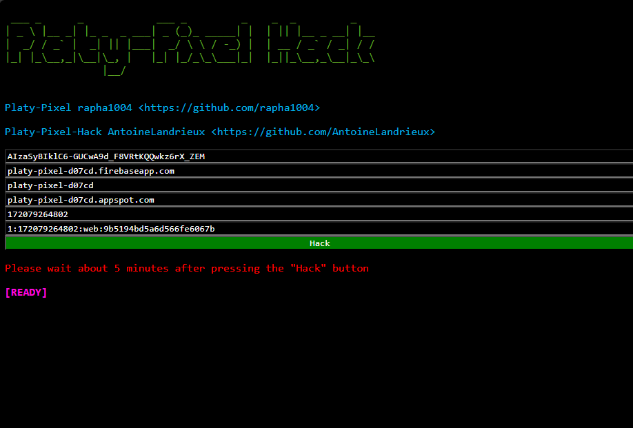

# platy-pixel-hack

---




## Usage

**You need a local server for `platy-pixel-hack`

Using PhP:

```sh
php -S "127.0.0.1:8080"
```

> [!NOTE]
>
> You can change image (120x60) in `resources/image/image.png`
>
> It is recommended to draw a little after running the script to save the pixels placed.
>

## Contributing

The platy-pixel-hack source code is located in the Git repository at [github.com/AntoineLandrieux/platy-pixel-hack](https://github.com/AntoineLandrieux/platy-pixel-hack/).
Contributions are most welcome by forking the repository and sending a pull request.

## Credit

See **[AUTHORS file](AUTHORS)**

**Platy Pixel Developer**:

- [rapha1004](https://github.com/rapha1004): <https://github.com/rapha1004/>

**Contributors :**


