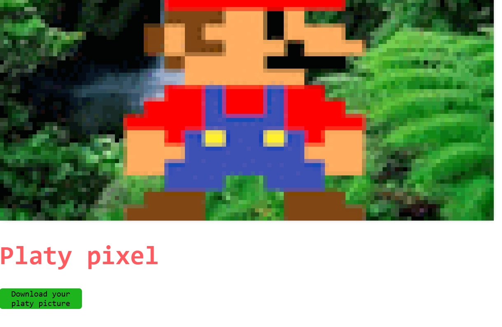

# platy-pixel-hack

---

## Exemple

Using PhP:

```sh
php -S "127.0.0.1:8080"
```

Now we will run the code on a browser like Microsoft Edge

```sh
msedge "https://127.0.0.1:8080"
```

> [!NOTE]
>
> You can change image (120x60) in `resources/image/image.png`
>



## Platy Pixel Developer

- [rapha1004](https://github.com/rapha1004): <https://github.com/rapha1004/platy-pixel/>
